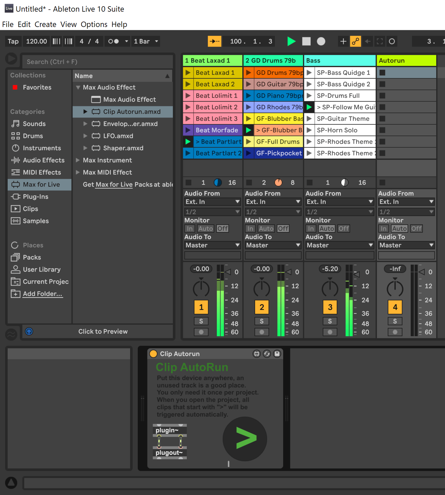
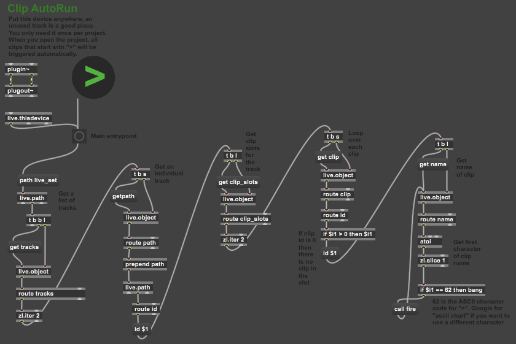

# Clip Autorun.amxd

## About

Clip Autorun is a Max4Live device that on-load will automatically trigger any clips in an Ableton Live project
that have a clip name starting with `>`. This is proof of concept quality code, use at your own risk.

It is a Max Audio Effect device that just passes through audio, so you can put it anywhere inside the project
and you only need one instance of it in the project. I recommend putting it on an unused track, since there is
no point routing audio through a pass-through plugin, but it probably won't hurt anything even if you put it
on a track with audio. The device has a big circular button that can be pressed if you want to test the
trigger without restarting Live.

## Installation

You can find a .zip file to download on the [releases](https://github.com/rycarus/max4live_autorun/releases) page.

To install the device, download the zip file from the releases page, extract `Clip Autorun.amxd` from the .zip
file and copy it to the `Presets/Audio Effects/Max Audio Effect` folder in your
[Ableton User Library](https://help.ableton.com/hc/en-us/articles/209774085-The-User-Library).

## Screenshots

Here is the device loaded into a Live project:

Here is what the device looks like when opened in Max:

